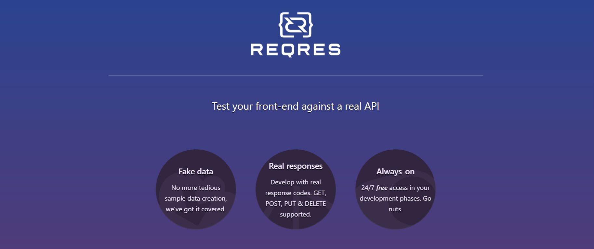
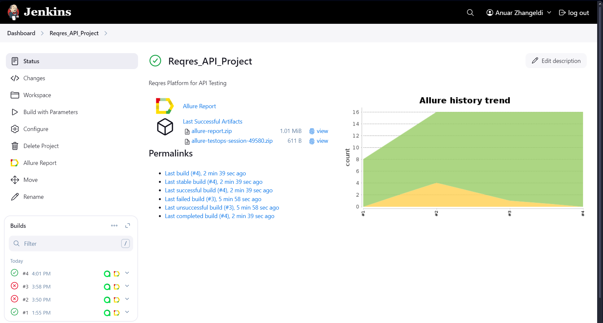
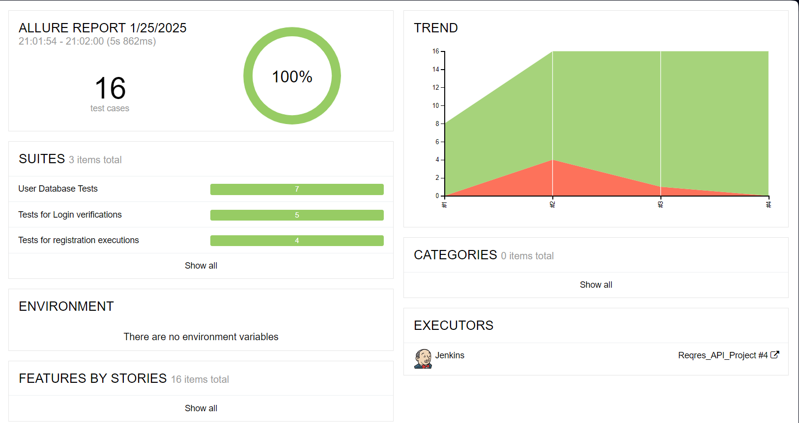
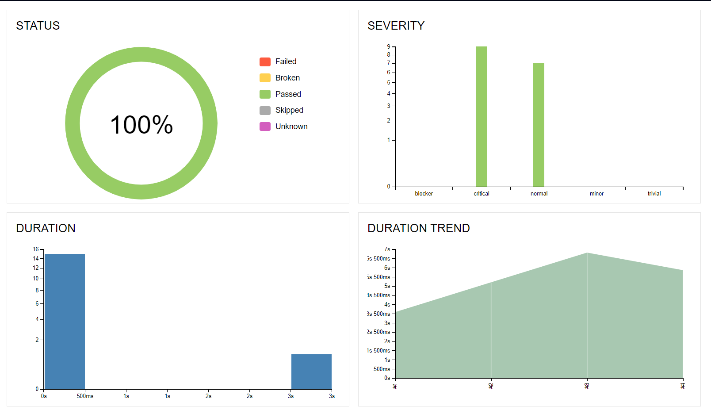
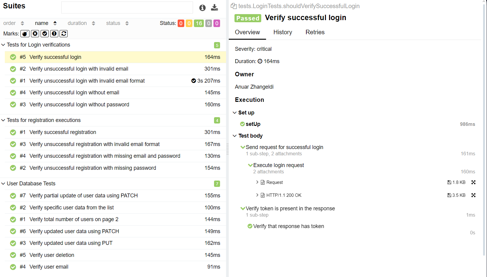
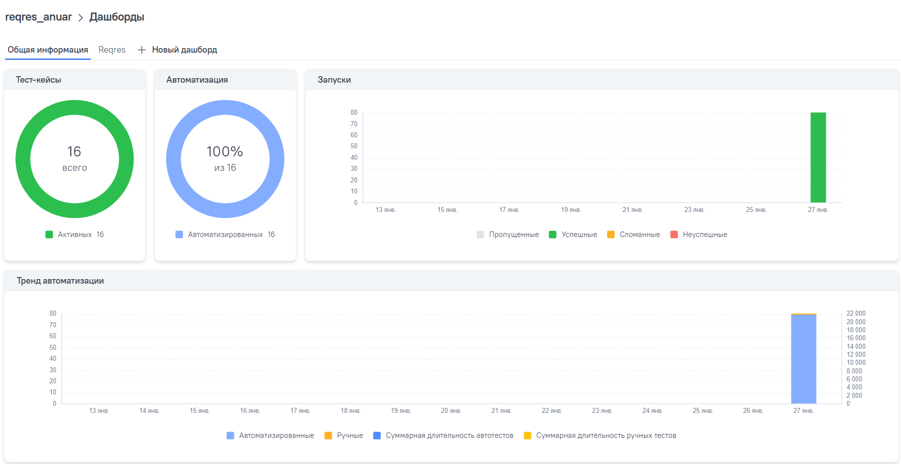
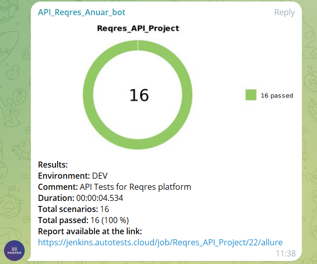

#  Reqres.in API Automation Testing


Welcome to the **Reqres.in API Automation Testing Project**! 

This repository demonstrates how to automate API testing for [Reqres.in](https://reqres.in/) using **Java** and **Selenide**. 

Developed as part of the QA.GURU educational platform, this project showcases practices in API testing, including test structure, reporting, and maintainability.

---

## 📝 Introduction

This project is designed for:
- Practicing API automation testing techniques.
- Understanding how to structure and execute API tests with modern tools.
- Gaining hands-on experience with **Selenide**, **REST Assured**, and other key technologies.

The testing scope includes verifying various RESTful API endpoints provided by Reqres.in for functionalities like user management, registration and data updates.





---

## 🔧 Technologies Used

### Programming Language


### Test Frameworks and Libraries
- : Used for its concise API for handling browser and API interactions.
- : Simplifies API request and response validation.
- : For organizing and executing test cases.

### Build and CI Tools
- : Dependency management and build automation.
- : CI/CD pipeline integration.

### Reporting and Monitoring
- : Centralized test management and detailed reporting of automated and manual tests.  
  **TestOps Dashboard:** [Allure TestOps Project](https://allure.autotests.cloud/project/4582/launches)

### Notifications and Alerts
- : Automated test execution notifications and alerts delivered to a configured Telegram channel.


---

## 🧪 Test Cases

### **Login Tests**
1. **Verify successful login** – `eve.holt@reqres.in` with correct password.  
2. **Verify unsuccessful login with invalid email** – Invalid email returns an error.  
3. **Verify unsuccessful login with invalid email format** – Proper validation for malformed emails.  
4. **Verify unsuccessful login without email** – Missing email triggers an error.  
5. **Verify unsuccessful login without password** – Missing password is appropriately handled.  

---

### **Registration Tests**
1. **Verify successful registration** – Proper registration returns valid ID and token.  
2. **Verify unsuccessful registration with missing password** – Error message indicates missing password.  
3. **Verify unsuccessful registration with invalid email format** – API rejects improper email format.  
4. **Verify unsuccessful registration with missing email and password** – Tests for completely missing fields.

---

### **User Database Tests**
1. **Verify total number of users on page 2** – Validates pagination and user count.
2. **Verify specific user data from the list** – Checks email or name of a specific user.
3. **Verify updated user data using PUT** – Confirms successful full updates.
4. **Verify partial update of user data using PATCH** – Tests partial updates to user data.
5. **Verify user email** – Validates the email field for a specific user.
6. **Verify user deletion** – Tests successful deletion of a user.
7. **Verify updated user data using PATCH** – Additional validation for partial updates.

---


### Reporting
- **Allure Reports**: Provides detailed insights into test execution and results.

---

## ✨ Features

- **Comprehensive Test Suite**: Covers all essential Reqres.in endpoints with both positive and negative test scenarios.
- **Parameterized Tests**: Supports data-driven testing for enhanced coverage.
- **Clear Reporting**: Generates interactive reports with Allure.
- **Error Handling**: Implements robust error handling for failed API responses.
- **Scalable Structure**: Follows a modular design pattern, making it easy to add new tests.

---

## 📂 Project Structure

```plaintext
src
├── main
│   ├── api
│   │   └── LoginApi, RegisterApi, UserApi (API request logic)
│   ├── models
│   │   └── RequestModel, ResponseModel (POJO classes for request/response)
│   └── utils
│       └── Utility classes (helper methods, constants)
├── test
    ├── tests
    │   └── LoginTests, RegisterTests, UserTests (test classes)
    └── resources
        └── Configuration files
```

---

## 🌐 CI/CD Integration

### **Jenkins**
The project is integrated with Jenkins for continuous integration and deployment. You can view the latest builds here:  
🔗 [Jenkins Job - Reqres API Project](https://jenkins.autotests.cloud/job/Reqres_API_Project/)


**Jenkins Build Status:**



**Allure Report Overview:**




**Graphical Representation in Allure Reports:**



**Test Cases:**



---

## 📊 Test Reports

### **Allure TestOps**
Interactive test execution results and detailed reporting are available on Allure TestOps:  
🔗 [Allure Dashboard - Reqres API Project](https://allure.autotests.cloud/project/4582/launches)

**Dashboard:**




**Test cases:**


---

---

##  Telegram Notifications

Telegram is integrated to notify the team about test execution results.

Notifications include:
- Duration
- Comment
- Summary of executed tests
- Links to detailed reports for easy debugging

**Example Telegram Notification:**



---
